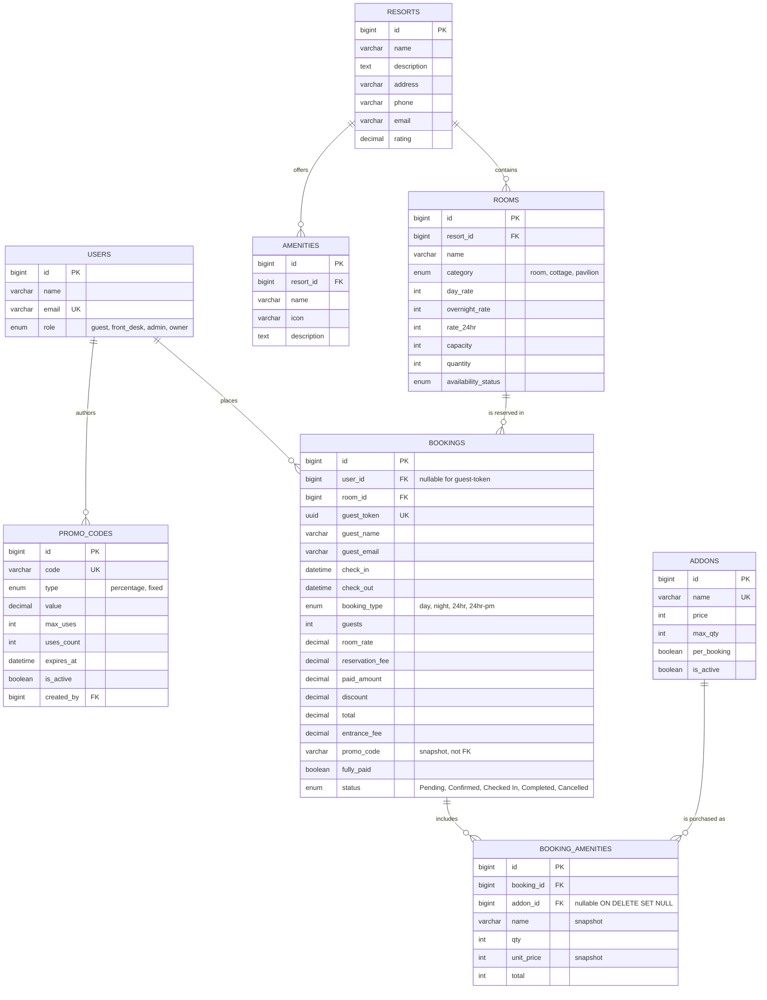

# ERD · Booking & Payment (Mermaid / verb-labeled)

Paste into any Markdown viewer that supports Mermaid (GitHub, VS Code, Notion, Obsidian) — renders inline. For a strict Chen-notation drawing with diamond shapes, use this as a reference and redraw in draw.io / Lucidchart.

## Relationship glossary

| Parent → Child | Verb | Cardinality | Notes |
|---|---|---|---|
| USERS → BOOKINGS | places | 1:N | Nullable — guests (no account) have `user_id = NULL` |
| USERS → PROMO_CODES | authors | 1:N | Owners only create promos |
| RESORTS → ROOMS | contains | 1:N | Every room belongs to exactly one resort |
| RESORTS → AMENITIES | offers | 1:N | Facet amenities (pool, Wi-Fi) |
| ROOMS → BOOKINGS | is reserved in | 1:N | A room has many historical bookings |
| BOOKINGS → BOOKING_AMENITIES | includes | 1:N | Add-on line items per booking |
| ADDONS → BOOKING_AMENITIES | is purchased as | 1:N | Nullable — catalog deletes set FK to NULL, snapshot preserves the receipt |
