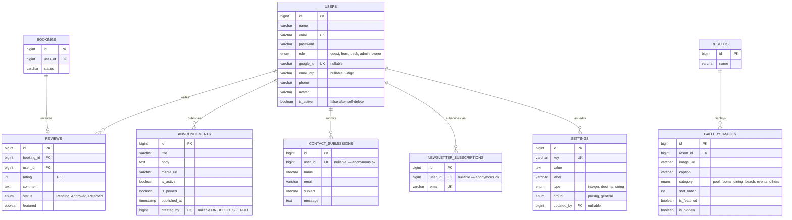

# ERD · Users & Content (Mermaid / verb-labeled)

## Relationship glossary

| Parent → Child | Verb | Cardinality | Notes |
|---|---|---|---|
| USERS → REVIEWS | writes | 1:N | Composite unique `(user_id, booking_id)` — one review per stay |
| BOOKINGS → REVIEWS | receives | 1:0..1 | A booking has at most one review |
| RESORTS → GALLERY_IMAGES | displays | 1:N | |
| USERS → ANNOUNCEMENTS | publishes | 1:N | Owners only; NULL if creator deleted |
| USERS → CONTACT_SUBMISSIONS | submits | 1:N | Nullable — anonymous form allowed |
| USERS → NEWSLETTER_SUBSCRIPTIONS | subscribes via | 1:N | Nullable — anonymous signup allowed |
| USERS → SETTINGS | last edits | 1:N | Nullable — tracks most recent editor |
