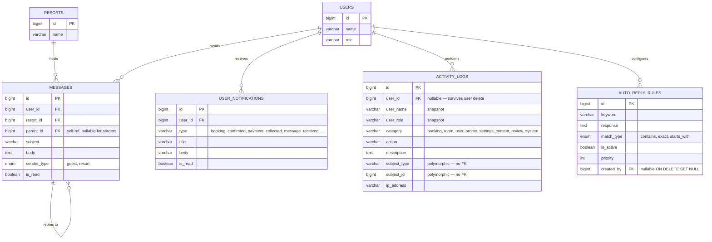

# ERD · Activity & Messaging (Mermaid / verb-labeled)

## Relationship glossary

| Parent → Child | Verb | Cardinality | Notes |
|---|---|---|---|
| USERS → MESSAGES | sends | 1:N | `sender_type` (enum) tells us if the message is from the guest or the resort |
| RESORTS → MESSAGES | hosts | 1:N | Conversation thread belongs to a resort |
| MESSAGES → MESSAGES | replies to | 1:N | Self-referential: `parent_id` points at the thread starter |
| USERS → USER_NOTIFICATIONS | receives | 1:N | In-app alerts (booking updates, new replies) |
| USERS → ACTIVITY_LOGS | performs | 1:N | Audit trail; preserves the log even after user is deleted |
| USERS → AUTO_REPLY_RULES | configures | 1:N | Owners only author chatbot rules |

> **Polymorphic caveat**: `activity_logs.subject_type` + `subject_id` form a polymorphic link to any model (Booking, Room, PromoCode, etc.). No FK constraint — resolved at application level.
