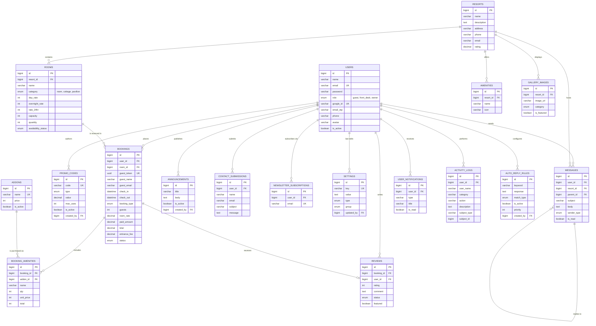

# ERD · Full Schema (Mermaid / verb-labeled)

Every table, one diagram. Every table participates in at least one relationship — no floating entities.

## Full relationship glossary

| Parent → Child | Verb | Domain |
|---|---|---|
| USERS → BOOKINGS | places | Booking & Payment |
| USERS → PROMO_CODES | authors | Booking & Payment |
| USERS → REVIEWS | writes | Users & Content |
| USERS → ANNOUNCEMENTS | publishes | Users & Content |
| USERS → CONTACT_SUBMISSIONS | submits | Users & Content |
| USERS → NEWSLETTER_SUBSCRIPTIONS | subscribes via | Users & Content |
| USERS → SETTINGS | last edits | Users & Content |
| USERS → MESSAGES | sends | Activity & Messaging |
| USERS → USER_NOTIFICATIONS | receives | Activity & Messaging |
| USERS → ACTIVITY_LOGS | performs | Activity & Messaging |
| USERS → AUTO_REPLY_RULES | configures | Activity & Messaging |
| RESORTS → ROOMS | contains | Booking & Payment |
| RESORTS → AMENITIES | offers | Booking & Payment |
| RESORTS → GALLERY_IMAGES | displays | Users & Content |
| RESORTS → MESSAGES | hosts | Activity & Messaging |
| ROOMS → BOOKINGS | is reserved in | Booking & Payment |
| BOOKINGS → BOOKING_AMENITIES | includes | Booking & Payment |
| BOOKINGS → REVIEWS | receives | Users & Content |
| ADDONS → BOOKING_AMENITIES | is purchased as | Booking & Payment |
| MESSAGES → MESSAGES | replies to | Activity & Messaging |

**Every table participates** in at least one relationship. No orphans.
